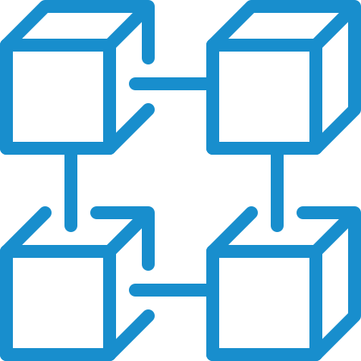

    

        

            
        

        

            <a href="https://ml-explore.github.io/mlx/build/html/index.html">​MLX</a> is an array framework for efficient and flexible machine learning on Apple silicon.
        

    

    

        

            
        

        

            MLX can be run on any Apple platform that supports Metal.
             
            <ul class="fade-in">
                <li>MLX Core has <a href="https://ml-explore.github.io/mlx/build/html/index.html">Python</a> and <a href="https://ml-explore.github.io/mlx/build/html/cpp/ops.html">C++</a> bindings</li>
                <li><a href="https://swiftpackageindex.com/ml-explore/mlx-swift/main/documentation/mlx">MLX Swift</a></li>
                <li><a href="https://github.com/ml-explore/mlx-c">MLX C</a></li>
            </ul>
            Some key features of MLX are:
             
            <ul class="fade-in">
                <li>A familiar API based on NumPy</li>
                <li>Designed for unified memory</li>
                <li>Composable function transformations</li>
                <li>Multi-device support (CPU or GPU)</li>
            </ul>
        

    

    

        

            
Get started with MLX on Apple silicon.

        

        <ul class="page-sub-content fade-in">
            <li>
                <a href="https://github.com/ml-explore/mlx-lm">MLX LM</a> - a Python package for generating text and fine-tuning language models on Apple silicon.
            </li>
            <li>
                <a href="https://github.com/ml-explore/mlx-examples/tree/main/whisper">MLX Whisper</a> - a Python package for speech transcription using OpenAI’s Whisper models.
            </li>
            <li>
                <a href="https://github.com/ml-explore/mlx-examples">MLX Examples</a> - standalone examples in the MLX framework including image generation, speech and music generation, language model training and many more.
            </li>
            <li>
                <a href="https://github.com/ml-explore/mlx-swift-examples">MLX Swift Examples</a> - examples in MLX Swift including LLM and VLM text generation, low-rank fine-tuning, and image generation with SDXL.
            </li>
        </ul>
    

    

        

            
Check out the growing community.

        

        <ul class="page-sub-content fade-in">
            <li>
                
            </li>
            <li>
                
            </li>
        </ul>
        

            

                In addition to the Apple-released examples, there are a growing number of <a href="https://github.com/ml-explore/mlx/discussions/654">community-built projects</a> that show how the framework can be used to bring a wide range of models to Apple silicon.
            

        

    

